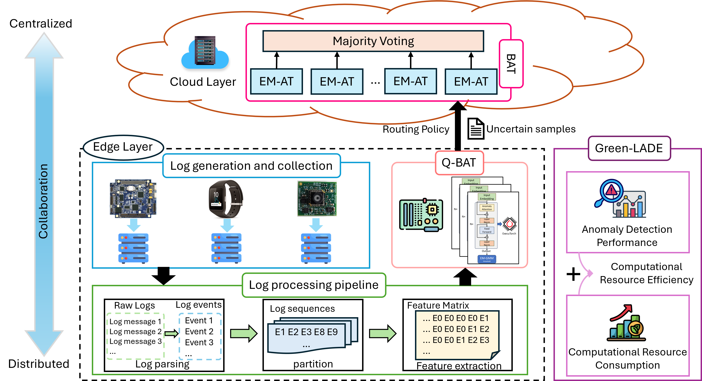
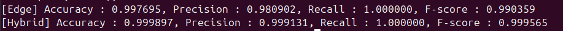
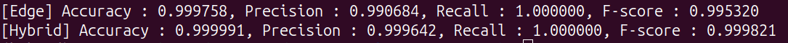
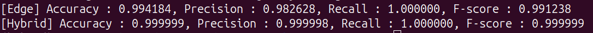

# Overview

In this repository, you will find a Python implementation of CECO-LAD: a Cloud-Edge Collaboration Framework for Unsupervised Log Anomaly Detection.

# Introduction to CECO-LAD

Artificial intelligence (AI)-driven Log Anomaly Detection (LAD) is a critical component for maintaining the security and reliability of cyber infrastructure. However, deploying an effective LAD system in real-world environments presents a significant challenge, the cloud-edge dilemma, where accurate deep learning models favor centralized cloud resources, but operational constraints (e.g., latency, bandwidth, privacy, and energy) favor edge-local analysis. To address these challenges, we propose CECO-LAD, a cloud-edge collaborative framework for unsupervised log anomaly detection that balances detection accuracy with resource efficiency. In CECO-LAD, we propose an enhanced version of Anomaly Transformer (AT) as a base learner. Building on enhanced AT, we further proposed a novel ensemble learning approach as the core of CECO-LAD: the BAT for cloud deployment and Q-BAT for resource-constrained edge environments. A Mahalanobis distance-based routing policy enables cloud-edge collaboration by selectively forwarding only uncertain samples to the cloud and retaining confident cases at the edge, thereby minimizing resource consumption while maximizing detection accuracy. Additionally, we propose Green-LADE, a Green AI-inspired method to enable holistic evaluation.

<p align="center">
  
</p>

# Repository Structure

- Cloud/: Cloud-side BAT training, testing, ensemble inference, and datasets.
- Edge/: Edge-side Q-BAT (ExecuTorch) models, routing, hybrid evaluation, and prediction_results.
- environment/: Conda environment and Python dependency specifications for cloud and edge.
- pictures/: Figures for the framework and example performance of OpenStack.
- collaborative_execution.sh: Top-level script (run on the edge device) that orchestrates the full cloud–edge collaboration pipeline.

# Get Started

## Configuration

### Cloud

- Ubuntu 24.04
- NVIDIA driver 580.126.09
- CUDA 12.4
- Python version >= 3.8
- PyTorch 2.4.0+cu124

### Edge

- Ubuntu 20.04
- Python 3.10
- PyTorch 2.4.0

## Installation

This code requires the packages listed in environment.yml and requirements.txt. The conda environments are recommended to run this code:

```bash
conda env create -f ./environment/cloud/environment.yml
conda activate ceco-lad-cloud
pip install -r ./environment/cloud/requirements.txt
```

```bash
conda env create -f ./environment/edge/environment.yml
conda activate ceco-lad-edge
pip install -r ./environment/edge/requirements.txt
```

## Download Data

CECO-LAD is implemented on [HDFS](https://github.com/logpai/loghub/tree/master/HDFS), [OpenStack](https://github.com/logpai/loghub/tree/master/OpenStack), and [BGL](https://github.com/logpai/loghub/tree/master/BGL) datasets. These datasets are available on [LogHub](https://github.com/logpai/loghub).

## Download Trained Model

The pre-trained BAT models can be downloaded from the [Google Drive](https://drive.google.com/drive/folders/1dh_pSu5M7fZVIWpdwfyBa4OLC4MKO1N0?usp=drive_link). The pre-trained Q-BAT models are included in the ./Edge/executorch/checkpoints.

## Precomputed Prediction Data

To simplify reproduction of the reported results, we also provide all precomputed prediction-related data in Edge/prediction_results/prediction_data.zip.

This zip contains ready-to-use score files, thresholds, predictions, selected indices, and other intermediate results for the OpenStack dataset. You can directly use these files with the provided scripts (e.g., for routing, hybrid evaluation, and Green-LADE analysis) without re-running model training or inference.

# Experiment

In all example scripts, we use **OpenStack** as the running example dataset to showcase the end-to-end CECO-LAD framework. The same workflow applies to **BGL** and **HDFS** by switching dataset-specific configs and paths.

## Cloud-based BAT

For BAT, it is a bagging-based ensemble; we use 81 base EM-AT models for BAT in CECO-LAD. To ensure robustness, we use four parameters: num_epochs, k (loss weight), e_layer_num (number of encoder layer), and batch_size. The detailed configs for BAT are provided in ./model_config/bat_config.

The following commands demonstrate how to launch BAT training and evaluation from the Cloud directory:

```bash
cd Cloud

# To train BAT model
python train_ensemble.py

# To test BAT model
python test_ensemble.py --voting majority
```

## Edge-based Q-BAT

Here we use [ExecuTorch](https://docs.pytorch.org/executorch/0.3/) (version 0.3) for lowering and optimizing models at the edge. Q-BAT is implemented as an ensemble of quantized EM-AT base models (K = 3) running on the edge device. After you clone ExecuTorch into `Edge/executorch/`, **all files and folders inside `Edge/` belong to the ExecuTorch project and are required for the Q-BAT edge pipeline**, so they should be kept intact when running Q-BAT. (Put these under executorch/)

First of all, according to the guideline of ExecuTorch, you can clone and install ExecuTorch locally.

```bash
cd Edge

git clone --branch v0.3.0 https://github.com/pytorch/executorch.git
cd executorch

# Update and pull submodules
git submodule sync
git submodule update --init

# Install ExecuTorch pip package and its dependencies, as well as
# development tools like CMake.
# If developing on a Mac, make sure to install the Xcode Command Line Tools first.
./install_requirements.sh

# Clean and configure the CMake build system. Compiled programs will appear in the executorch/cmake-out directory we create here.
(rm -rf cmake-out && mkdir cmake-out && cd cmake-out && cmake ..)

# Build the executor_runner target
cmake --build cmake-out --target executor_runner -j9
```

### Runner Customize

After setting up the executorch, we need to customize the executor_runner to enable the customized input data. By replacing the **executor_runner.cpp** in the folder `./executorch/examples/portable/executor_runner` to enable user customized runner.

After updating the executor_runner file, build the executor_runner target again:

```bash
# Build the executor_runner target
cmake --build cmake-out --target executor_runner -j9
```

### Model conversion

For Q-BAT model, we utilize executorch and torchao for edge optimization and quantization. To quantize the model and convert from .pth to .pte file, please run the following:

```bash
python convert_torchao.py
```

### Model Inference

To save time, both the trained Q-BAT models and the preprocessed datasets for executing at the edge can be downloaded from the [Google Drive](https://drive.google.com/drive/folders/1pBNMsucvw1eypn5gC_QvOzeRnMgTzLq2?usp=drive_link).

Model inference with Q-BAT on the edge is orchestrated by the main script in the Edge folder (i.e., `execute_edge.sh`). This script coordinates the ExecuTorch runners and helper utilities to:

- Execute Q-BAT models and produce anomaly scores for each dataset.
- Computing per-model thresholds using EM-GMM-based method from training scores.
- Convert anomaly scores into binary predictions on the edge.
- Routing via Mahalanobis distance-based policy, providing selected samples that are transmitted to the cloud for more accurate prediction.
- Finally, perform collaborative evaluation that aggregate edge predictions and cloud predictions.

To execute the Q-BAT models and run the full edge-side pipeline using the example of OpenStack settings, run:

```bash
cd Edge
bash execute_edge.sh
```

## Cloud–Edge Collaboration Demo (OpenStack example)

CECO-LAD is designed for deployment in heterogeneous cloud-edge environments, where **Cloud** and **Edge** run on different devices. We provide scripts that implement the full pipeline using the OpenStack as an example:

- On the **Edge** device, deploy and execute the top-level `collaborative_execution.sh` script to run the end-to-end edge and cloud–edge workflow using OpenStack as the example dataset.
- The scripts orchestrate: (1) Q-BAT inference on the edge, (2) Mahalanobis distance-based routing of uncertain samples, (3) BAT ensemble inference on the cloud only for the routed subset, and (4) collaborative evaluation that aggregate edge and cloud predictions.

To help users quickly understand and reproduce the collaboration workflow, all intermediate and final results (scores, thresholds, indices, predictions, and hybrid metrics) from our experiments are already stored under the `prediction_results/` directory (and its `prediction_data.zip` archive).

Please refer to the scripts under edge_scripts/ and the top-level collaborative_execution.sh for the exact commands.

Here is the screenshot of Q-BAT performance and CECO-LAD performance using the OpenStack dataset.

<p align="center">
  
</p>

Here is the screenshot of Q-BAT performance and CECO-LAD performance using the HDFS dataset.

<p align="center">
  
</p>

Here is the screenshot of Q-BAT performance and CECO-LAD performance using the BGL dataset.

<p align="center">
  
</p>
