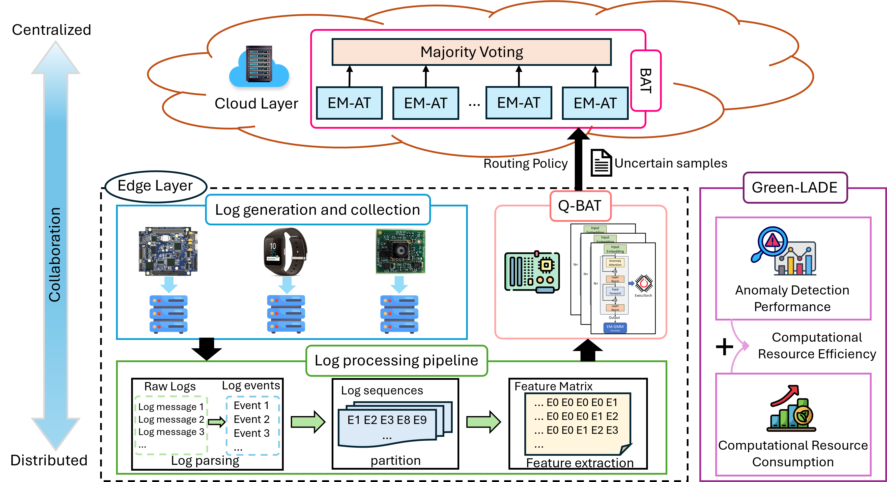
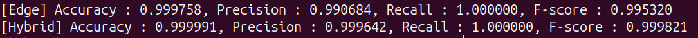
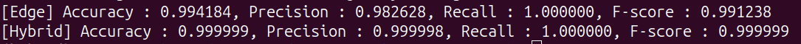

# CECO-LAD

**Cloud-Edge Collaborative Log Anomaly Detection**

[](https://www.python.org/)
[](https://pytorch.org/)
[](LICENSE)
[](https://kismetzz-ceco-lad.hf.space/)

**[🤗 Try the live demo on Hugging Face Spaces](https://kismetzz-ceco-lad.hf.space/)**

---

## How It Works

CECO-LAD detects anomalies in system logs using a hybrid Cloud-Edge collaboration pipeline:

- **Q-BAT edge models** run locally on resource-constrained edge devices.
- Only the **most uncertain lines** are forwarded to the **BAT cloud ensemble** for more accurate reevaluation.

<p align="center">
  
</p>

### Models

| Model     | Where      | What                                                                              |
| --------- | ---------- | --------------------------------------------------------------------------------- |
| **BAT**   | Cloud      | 81 EM-AT models with varied hyperparameters and bootstrap-resampled training data |
| **Q-BAT** | Edge (CPU) | BAT checkpoints quantized to A8W4 format via ExecuTorch                           |
| **EM-AT** | Cloud      | EM-GMM Enhanced Anomaly Transformer — base learner                                |

### Framework Overview

System logs are first generated from diverse servers and applications and collected by distributed log collection servers. A log processing pipeline then parses raw log messages into structured formats, partitions them into sequences, and converts them into feature matrices as input for the anomaly detector.

For deployment in heterogeneous cloud-edge environments, CECO-LAD adopts a collaborative inference strategy: the BAT model is hosted on the cloud server, while the lightweight Q-BAT model runs on resource-constrained edge devices. A Mahalanobis distance-based routing policy enables collaborative anomaly analysis, forwarding hard cases from the edge to the cloud for more accurate prediction. Finally, the Green-LADE method is integrated to assess computational resource efficiency, quantifying the trade-off between resource consumption and detection capability across cloud and edge deployments.

---

## Repository Structure

```
CECO-LAD/
├── start.py                   # One-command local setup + dashboard launch
├── run.py                     # CLI: train / eval / infer / convert / download
│
├── ceco_core/                 # Shared model library (EM-AT, energy scoring, voting)
├── training_pipeline/         # BAT ensemble training and threshold evaluation
├── edge_pipeline/             # Q-BAT quantization (BAT → ExecuTorch .pte)
├── inference_pipeline/        # Full edge → routing → cloud pipeline
│   └── executorch/            # Pre-built ExecuTorch 0.5.0 runtime (downloaded by start.py)
├── dashboard/                 # FastAPI + single-page web dashboard
│
├── configs/                   # Training and inference YAML configs per dataset
├── data/                      # Pre-processed dataset files (included in repo)
├── checkpoints/               # Model weights — downloaded by start.py
├── outputs/                   # Inference results — generated at runtime
│
└── tools/
    ├── download_checkpoints.py  # Downloads BAT / Q-BAT checkpoints
    └── download_data.py         # Downloads ExecuTorch + raw logs
```

---

## Quick Start — Dashboard

```bash
# 1. Clone
git clone https://github.com/kiSmetZz28/CECO-LAD.git
cd CECO-LAD

# 2. Set up the environment
conda create -yn ceco-lad python=3.10.0
conda activate ceco-lad
pip install torch==2.4.0 --extra-index-url https://download.pytorch.org/whl/cpu
pip install -r environment/cloud/requirements.txt
pip install -e .
pip install gdown huggingface_hub

# 3. Download assets and launch
python start.py
```

Open **http://localhost:8765** in your browser.

> `start.py` automatically downloads all required assets (~4 GB) on first run. On first launch the **Database** indicator shows **Loading** while log data is imported (~1–2 min).

---

## Full Setup

All commands run from the project root. Two Conda environments are needed:

| Environment | Purpose                                         |
| ----------- | ----------------------------------------------- |
| `ceco-lad`  | Dashboard, training, evaluation, edge inference |
| `hybrid`    | Cloud BAT inference (81 checkpoints)            |

### Step 1 — Set up environments

```bash
# ceco-lad (CPU)
conda create -yn ceco-lad python=3.10.0 && conda activate ceco-lad
pip install torch==2.4.0 --extra-index-url https://download.pytorch.org/whl/cpu
pip install -r environment/cloud/requirements.txt && pip install -e . && pip install gdown huggingface_hub

# ceco-lad (GPU — recommended for training)
pip install -r environment/cloud/requirements.txt --extra-index-url https://download.pytorch.org/whl/cu124

# hybrid
conda create -yn hybrid python=3.10.0 && conda activate hybrid
pip install -r environment/cloud/requirements.txt --extra-index-url https://download.pytorch.org/whl/cu124
pip install -e .
```

> ExecuTorch **0.5.0** ([docs](https://docs.pytorch.org/executorch/0.5/)) is downloaded and its Python bindings installed automatically by `start.py` — no manual compilation needed. Linux/macOS only; Windows users: use WSL2.

### Step 2 — Download pre-trained models

```bash
python start.py --setup-only                              # everything
python tools/download_checkpoints.py --dataset bgl        # one dataset
python tools/download_checkpoints.py --type qbat          # Q-BAT only (~220 MB)
```

### Step 3 — Generate detection thresholds

```bash
conda activate ceco-lad
python run.py eval os && python run.py eval bgl && python run.py eval hdfs
```

Evaluates the BAT ensemble on the test set, fits a GMM, and writes `outputs/{dataset}/thresholds_cloud.yaml`.

### Step 4 — Run inference

```bash
conda activate ceco-lad
python run.py infer os    # ~5–15 min per dataset on CPU
python run.py infer bgl
python run.py infer hdfs
```

### Step 5 — (Optional) Train from scratch

```bash
conda activate ceco-lad   # or hybrid for GPU
python run.py train os && python run.py train bgl && python run.py train hdfs
```

Runs a hyperparameter sweep — 81 models per dataset. GPU strongly recommended (2–8 hours per dataset). Then re-run Step 3.

### Step 6 — (Optional) Convert to edge models

```bash
conda activate ceco-lad
python run.py convert os && python run.py convert bgl && python run.py convert hdfs
```

Applies A8W4 quantization and exports `.pte` files to `checkpoints/qbat/{dataset}/`. Skip if you downloaded Q-BAT checkpoints in Step 2.

---

## Using the Dashboard

Try the **[live demo on Hugging Face Spaces](https://kismetzz-ceco-lad.hf.space/)** — no setup needed.

For local use:

```bash
conda activate ceco-lad
python start.py   # or python dashboard/app.py if assets are already present
```

Open **http://localhost:8765**. A built-in **? Help** button guides you through all features.

---

## Results

### OpenStack

<p align="center">
  
</p>

### HDFS

<p align="center">
  
</p>

### BGL

<p align="center">
  
</p>
